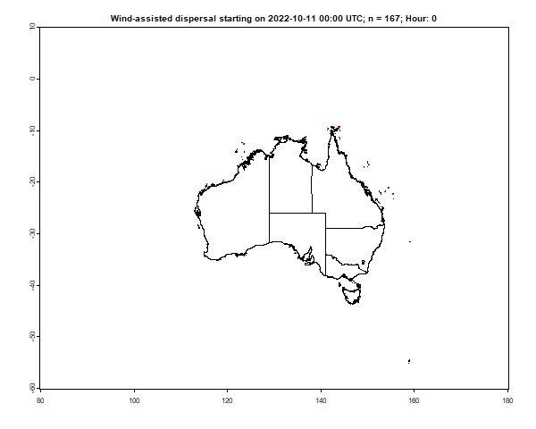
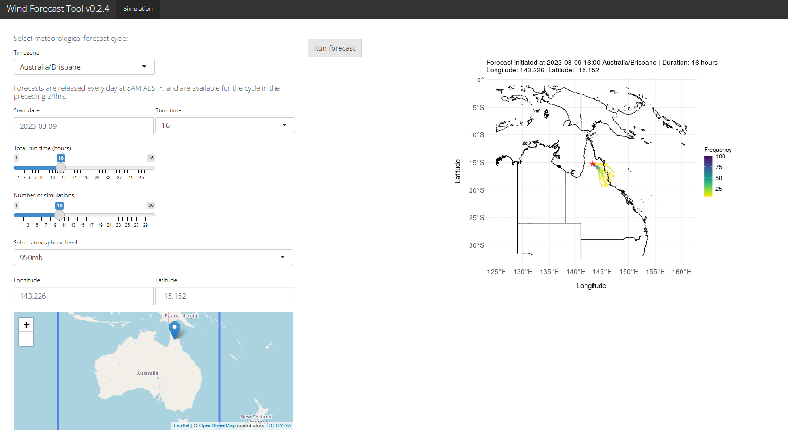

## Wind Dispersal Forecasting Tool

This is an app developed by [Cesar Australia](https://cesaraustralia.com/) to run real-time simulations of wind-assisted dispersal using the cellular automata model.

### Cellular automata model for wind-assisted dispersal

The cellular automata (CA) model for wind-assisted dispersal was developed by Cesar Australia research scientists as part of a project funded by Plant Health Australia to help predict movements of fall armyworm (FAW; *Spodoptera frugiperda*) in Australia. FAW is lepidopteran pest species which causes major damage to economically important cultivated grasses, vegetable crops, and cotton. It was first reported in Australia in January 2020, and has rapidly spread across Eastern Australia.

The CA algorithm was developed to provide quick and efficient simulations of flight trajectories for wind-assisted dispersal. CA is a spatially explicit technique that incorporates spatial interactions between cells and their neighbourhood to generate a global pattern. Thus, the CA model for wind-assisted dispersal allows rapid calculation of flight trajectories from gridded wind direction and velocity layers, using multiple starting locations.

A full description of the model and validation against recorded FAW movements in Eastern Australia will be made available in a formal publication, currently in progress.

#### Data used for simulations

Meteorological forecast cycles are sourced daily from the [NOAA Global Forecast System (GFS)](https://www.ncei.noaa.gov/products/weather-climate-models/global-forecast). Forecasts are available for 48h in 6 hour intervals (UTC 00:00, 06:00, 12:00, 18:00) at a 0.25 degrees spatial resolution (roughly 25 x 25 km).

### Using the forecasting tool

To run a simulation, you need to select among several conditions:

1. Forecast cycle: Select a timezone and starting date and time for your simulation. Data are downloaded daily at 8AM AEST, and are kept for a week - hence you can run simulations with start times ranging up to a week prior to the current date. Start times are available at 6 hour intervals, and are converted to the selected timezone.

2. Simulation parameters:
- Select the total run time of the forecast, up to 48 hours.
- Select the number of simulations to run - since the algorithm contains some stochastic elements, more simulations will provide you with a more accurate estimate of the likely trajectory. Simulated trajectories can diverge greatly especially when wind speed is low and stochastic movements become more influential.
- Select the atmospheric level at which the simulation is run. Two are available: 950mb (equivalent to ~ 600 m a.s.l.) and 850mb (equivalent to ~ 1500 m a.s.l.).

*Note that longer total run times and greater numbers of simulations will result in longer computation times, but simulations should still finish in under four minutes at the most.*

3. Starting point: You can either input longitude and latitude manually (in decimal degrees), or click on the map to select a starting location for the simulation.

After you have selected all of your starting conditions, press the **Run forecast** button. After a short wait the results of your simulation will show up on the right, with cells coloured based on the frequency of simulated trajectories passing through them.

### Contact details

For any questions about the model or use of the online tool, please contact [Alex Slavenko](mailto:aslavenko@cesaraustralia.com?subject=Wind%20Dispersal%20Forecasting%20Tool) at Cesar Australia.
