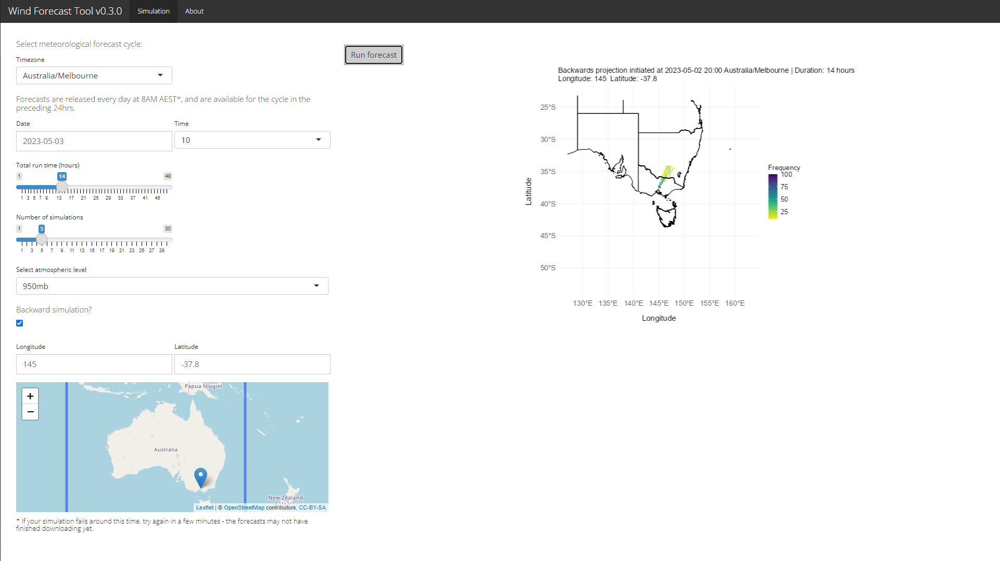

## Wind Dispersal Forecasting Tool

This is an app developed by [Cesar Australia](https://cesaraustralia.com/) to predict the wind- assisted dispersal of Fall Armyworm (FAW; *Spodoptera frugiperda*).
The app runs real-time simulations of dispersal using the cellular automata model, allowing users to predict the direction and distance that FAW will travel under different scenarios. 
FAW is lepidopteran pest species which causes major damage to economically important cultivated grasses, vegetable crops, and cotton. It was first reported in Australia in January 2020, and has rapidly spread across Eastern Australia.
As this pest can migrate large distances over short periods of time, regular monitoring and surveillance are vital. Knowing when the adult moths are likely to appear in an area helps to inform monitoring for larvae, and proactive management if required.   

### Cellular automata model for wind-assisted dispersal

The cellular automata (CA) model for wind-assisted dispersal was developed by Cesar Australia research scientists as part of a project funded by Plant Health Australia to help predict movements of FAW in Australia. 

The CA algorithm was developed to provide quick and efficient simulations of the direction and speed that FAW will travel via wind-assisted dispersal. The model incorporates both localised information and broad scale weather data to calculate where the moths will disperse to from selected starting locations. 

A full description of the model and validation against recorded FAW movements in Eastern Australia will be made available in a formal publication, currently in progress.

#### Data used for simulations

Meteorological forecast cycles are sourced daily from the [NOAA Global Forecast System (GFS)](https://www.ncei.noaa.gov/products/weather-climate-models/global-forecast). Forecasts are available for 48h in 6 hour intervals (UTC 00:00, 06:00, 12:00, 18:00) at a 0.25 degrees spatial resolution (roughly 25 x 25 km).

### Using the forecasting tool

To run a simulation, you need to select among several conditions:

1. Forecast cycle: Select a timezone and date and time for your simulation. Data are downloaded daily at 8AM AEST, and are kept for a week - hence you can run simulations with times ranging up to a week prior to the current date. Times are available at 6 hour intervals, and are converted to the selected timezone.

2. Simulation parameters:
  - Select the total flight duration of FAW, up to 48 hours.
  - Select whether to run the simulation forwards (i.e. Showing where the moths are predicted to disperse to) or backwards (i.e. predicting where the moths came from). If backwards, the chosen locality is the end point of the simulation, and the chosen date and time are the end points of the simulation.

3. Locality: The location of moths present to predict their direction of travel (forwards) or their predicted origin (backwards). You can either input longitude and latitude manually (in decimal degrees), or click on the map to select a locality for the simulation.

*Note that longer total run times and greater numbers of simulations will result in longer computation times, but simulations should still finish in under four minutes at the most. If more than five minutes have passed and no output has been created, please refresh and try again. If the error persists, contact Cesar Australia for support.*

After you have selected all of your starting conditions, press the **Run forecast** button. After a short wait the results of your simulation will show up on the right, with cells coloured based on the frequency of simulated trajectories passing through them.

For more information on surveillance and how to monitor for and manage FAW see:

[The Beatsheet article – QLD](https://thebeatsheet.com.au/key-pests/fall-armyworm/)

[NSWDPI surveillance – NSW](https://www.dpi.nsw.gov.au/biosecurity/plant/insect-pests-and-plant-diseases/fall-armyworm/)

[PestFacts south-eastern article – Vic](https://cesaraustralia.com/pestfacts/fall-armyworm-victoria-maize/)

### Contact details

For any questions about the model, suggestions for the online tool, or requests for information or new functionalities, please contact [Alex Slavenko](mailto:aslavenko@cesaraustralia.com?subject=Wind%20Dispersal%20Forecasting%20Tool) at Cesar Australia.

This tool was developed as part of Cesar Australia project CE1805CR3 with funding by Plant Health Australia (PHA).
